# SPG: Unsupervised Domain Adaptation for 3D Object Detection via Semantic Point Generation
This blog post reviews the paper [SPG: Unsupervised Domain Adaptation for 3D Object Detection via Semantic Point Generation](https://arxiv.org/abs/2108.06709) published in ICCV 2021 [[1]](#1).
 

---

 

## **Introduction**
Have you ever thought about why we often train and evaluate neural networks on splits from the same data set? Different data sets also have different underlying probability distributions leading to a so-called domain gap, i.e., a distribution shift exists between them. Typical reasons for domain gaps are, for example, different environmental conditions, such as weather conditions making generalization challenging for 3D object detectors. The paper's authors primarily concentrate on the domain gap between dry and rainy weather conditions and identified the deteriorating point cloud quality as the root cause for the domain gap between them, resulting in **missing LiDAR points**. To close the domain gap, the authors utilize the concept of **Unsupervised Domain Adaptation (UDA)**. UDA aims to generalize a model to a novel target domain only using labels from the source domain. In the case of this paper, it means that the authors use two different datasets: They train their model on one dataset (source domain) and do inference on another dataset (target domain).

 

---

 

## **Related work**

### **Statistical normalization**
[[2]](#2) is the first published study targeting UDA for 3D LiDAR detection. The authors propose to normalize the objects' size of the source domain leveraging the objects' statistics of the target domain to close the size-level domain gap. So they shrink or enlarge the objects' bounding box and the enclosed point cloud in the source domain, as shown in figure 1.

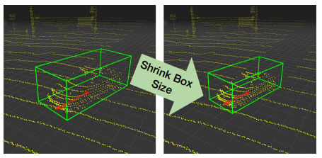

Figure 1: The key idea of statistical normalization

 

### **Point cloud upsampling**
Instead of transforming 3D point clouds by normalizing their size across domains, one can upsample them to account for deteriorating point cloud quality across domains by increasing the point cloud density, including the areas around the foreground objects. For example, PU-GAN [[3]](#3) learns many point distributions from the latent space and upsamples points over patches on object surfaces, as shown in figure 2.

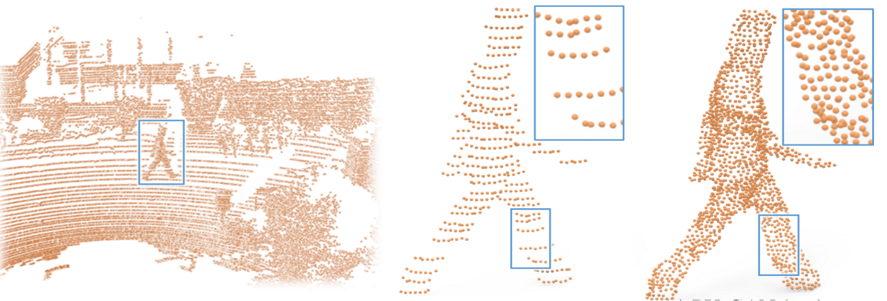

Figure 2: Visualization of PU-GAN upsampling

 

### **Problems with previous approaches**
Previous methods that can be applied to point clouds, including foreground and background regions, either use information not available in practice during inference (Statistical normalization) or are limited in recovering very partially observed 3D objects (PU-GAN). Therefore, the authors propose SPG, one of the first learning-based models that targets UDA for 3D point cloud detection by faithfully recovering the foreground regions suffering from missing LiDAR points [[1]](#1).

 

---

 

## **Method**

### **Problem setup**

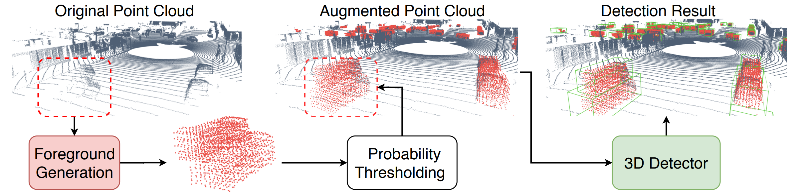

Figure 3: SPG and its surrounding context

 

Given a sparse, partially incomplete, **original point cloud**, the goal is to recover the foreground objects by generating additional (semantic) points (**foreground generation**). After that, SPG only selects points above a certain threshold (**probability thresholding**) to complete the original point cloud. The resulting **augmented point cloud** is fed into an external **3D object detector** to predict the 3D bounding boxes around the foreground objects (**detection results**).

 

### **Foreground generation**

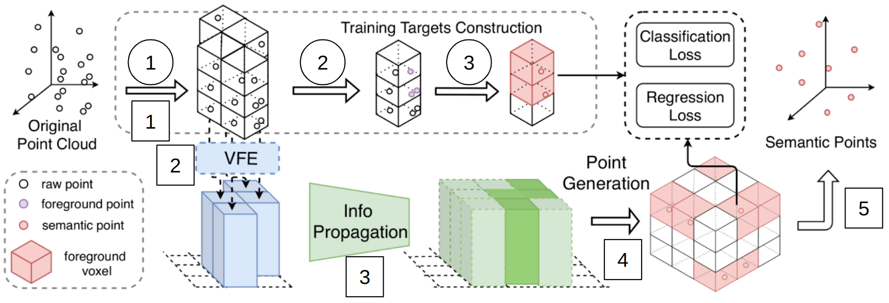

Figure 4: SPG model structure

 

As shown in figure 4, SPG consists of one branch (at the bottom) to generate the semantic points and another (at the top) for the training targets construction. First, we look into semantic point prediction.

#### **Semantic point prediction**
##### **1. Voxelization:**
As input, both branches get a raw 3D point cloud from either the source domain during training or the target domain during inference. This point cloud is voxelized and fed into the voxel feature encoding module.

##### **2. Voxel Feature Encoding module:**
The Voxel Feature Encoding (VFE) module consists of two different models. One part is the VFE network [[4]](#4) and the other part comprises the pillar feature network [[5]](#5):

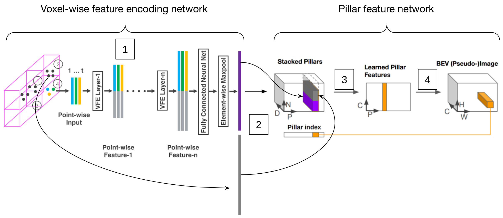

Figure 5: VFE module

 

1. **VFE network:** The voxelized 3D point cloud is passed to a series of MLPs to generate voxel-wise features for all occupied voxels meaning that they enclose points.

2. **Stacking:** Those voxel-wise features are stacked into a pillar tensor of size $(D \times N \times P)$ (see figure 5), where $P$ represents the number of pillars within the 3D space, $N$ counts the number of voxels per pillar, and $D$ is the feature dimension.

3. **2D projection:** A subsequent linear layer, including batch normalization and ReLU, transforms $D$ to a birds-eye view channel dimension $C$. A max pooling operation along the dimension $N$ performs a 2D projection of the pillars leading to a $(C \times P)$ tensor.

4. **Scattering:** Finally, those projected pillar features are scattered back to the original pillar locations using the stored pillar index to create a pseudo-image from a birds-eye view of size $(C \times H \times W)$, where $H$ and $W$ represent the canvas size.

##### **3. Information propagation module:**
The information propagation module propagates the previously generated features of the occupied pillars (dark green in figure 5 after step 3) to the neighboring empty pillars (light green) using a series of CNNs. This enables SPG to recover the foreground regions in the empty space.

##### **4. Point generation module**
The point generation module maps the pillar features to the corresponding voxels in the **generation area**, being the region in which the model generates semantic points. For the current model, it is limited to the occupied voxels only. For the mapping procedure, the module creates for each voxel in the generation area a semantic point $\tilde{sp_i} = (\tilde{\psi_i}, \tilde{P_i})$ with semantic feature $\tilde{\psi_i} = (\tilde{\chi_i}, \tilde{f_i})$, where $\tilde{\chi_i}$ is a specific point location, $\tilde{f_i}$ are particular point properties (e.g. elongation, intensity) and $\tilde{P_i}$ is the foreground probability of $\tilde{sp_i}$.

#### **Training targets construction**
To answer this question, we look at the training targets construction:

1. Voxelization of the 3D point cloud.

2. Mark a point as foreground if it is inside an object bounding box from the source domain.

3. Calculate the ground truth semantic point $sp_i = (\psi_i, P_i)$ with ground truth, semantic feature $\psi_i = (\chi_i, f_i)$, where $\chi_i$ denotes the centroid of all foreground points within a voxel and $f_i$ their mean point properties. Since $sp_i$ is computed from foreground points, the authors set $P_i = 1$.

So the model should learn to predict $\tilde{sp_i}$ as close as possible to $sp_i$.

 

### **Foreground region recovery**
Since the described pipeline can only generate points in the occupied regions so far, the authors employ two strategies to enable SPG to also generate semantic points in the empty regions.

#### **Hide and Predict:**

Based on the current supervision scheme, SPG can only predict semantic points in voxels that initially contain foreground points. To enable SPG to infer the semantic point of each voxel from its neighboring voxels without having access to the original foreground points, the authors propose the method **Hide and Predict**:

1. Randomly select $\gamma$% of the occupied voxels with $\gamma \in [0, 100]$.

2. Hide all their points.

3. Pass all voxels, including the hidden ones, to the network.

#### **Semantic area expansion:**

However, SPG is still only supervised to generate semantic points in the occupied voxels (even hidden voxels are occupied initially). Therefore, the authors propose **expanding the semantic points' generation area**.

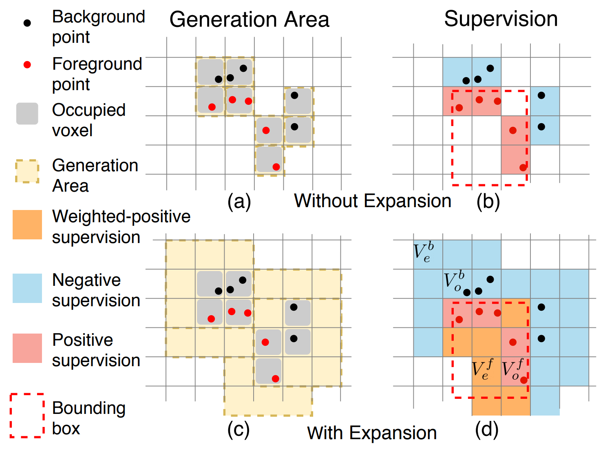

Figure 6: Semantic area expansion

 

As shown in figure 6, the current generation area without expansion only encompasses occupied voxels. While occupied background voxels (outside the object bounding box) contribute negative supervision, occupied foreground voxels (inside the object bounding box) give positive supervision. To expand the generation area also to the empty space (voxels that do not contain any points), the authors extend SPG's supervision scheme as follows (extensions are in bold):

1. Occupied and **empty background voxels** $\Rightarrow$ $P_f = 0$.

2. Occupied foreground voxels $\Rightarrow$ $P_f = 1$.

3. **Empty foreground voxels** $\Rightarrow$ $P_f = 1$ and the authors assign an additional weighting factor $\alpha$ used in the loss function.

Extending the supervision scheme and thereby expanding SPG's generation area increases the overall supervision signal during training.

 

### **Objective functions**

Finally, we want to look at the objective functions for training SPG:

1. **Foreground area classification loss:**
 
$L_{cls} = \frac{1}{|V_o \cup V_e^b|} \sum_{V_o \cup V_e^b} L_{focal}(\tilde{P}^f, P^f) + \frac{\alpha}{|V_e^f|} \sum_{V_e^f} L_{focal}(\tilde{P}^f, P^f) + \frac{\beta}{|V_{hide}|} \sum_{V_{hide}} L_{focal}(\tilde{P}^f, P^f)$

where $V_i^j$ indicates a specific voxel set with $i \in \{o, e, hide\}$ (occupied, empty, with hidden foreground points) and $j \in \{f, b, none\}$ (foreground, background, both). For example, $V_o^f$ denotes occupied foreground voxels and $V_e$ all empty voxels. For classification, the authors use the focal loss for different voxel sets instead of the cross entropy loss to mitigate the foreground-background class imbalance. The weighting factor $\alpha$ down-weights the influence of the empty foreground voxels on the total classification loss since $P_f = 1$ to recover the foreground regions in the empty space. However, many empty voxels within the bounding box are also not part of the object. Similarly, they introduce another weighting factor $\beta$ to up-weight the influence of the hidden voxels on the total classification loss.

2. **Feature regression loss:**
 
$L_{reg} = \frac{1}{|V_o^f|} \sum_{V_o^f} L_{SmoothL1}(\tilde{\psi}, \psi) + \frac{\beta}{|V_{hide}^f|} \sum_{V_{hide}^f} L_{SmoothL1}(\tilde{\psi}, \psi)$

For feature regression, they use the smooth L1 loss on $V_o^f$ and $V_{hide}^f$. Since $\psi_i$ is calculated from the foreground points being only available for $V_o^f$ and $V_{hide}^f$, the authors can solely incorporate those voxel sets in the feature regression loss.

 

---

 

## **Experiments and results**

### **Datasets and metrics**

The authors evaluate their model on two different tasks using two different datasets:

| Task | Dataset |
| --- | ---:|
| Unsupervised Domain Adaptation for 3D object detection | Waymo Domain Adaptation Dataset [[1]](#1)[[6]](#6)
| General 3D object detection | KITTI 3D object detection benchmark [[7]](#7)

Table 1: Tasks and datasets

 

The Waymo Domain Adaptation Dataset consists of:
- Source domain: Waymo Open Dataset (OD) with 99.40% frames having dry weather.
- Target domain: Waymo Kirkland Dataset (Kirk) with 97.99% frames having rainy weather.

The KITTI 3D object detection benchmark contains:
- 14999 RGB images and corresponding point clouds.
- 80256 labeled objects.

For both datasets, the authors use the following evaluation metrics[[1]](#1)[[6]](#6):
- BEV AP $= 100 \int_{0}^{1} \max\{p(r')|r' \geq r \} \,dr$
where $p(r)$ is the P/R curve.
- 3D AP $= 100 \int_{0}^{1} \max\{h(r')|r' \geq r \} \,dr$
where h(r) is computed similar to $p(r)$ but true positives are weighted by the heading accuracy.

 

### **Quantitative results**
For both tasks introduced before, the authors combine SPG with well-known 3D object detectors (either PointPillars or PV-RCNN).

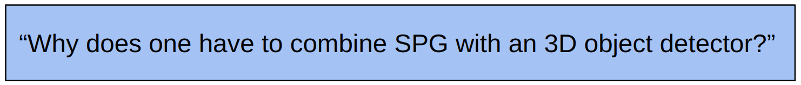

Remember, SPG only improves the deteriorated point cloud quality for a subsequent 3D object detector.

 

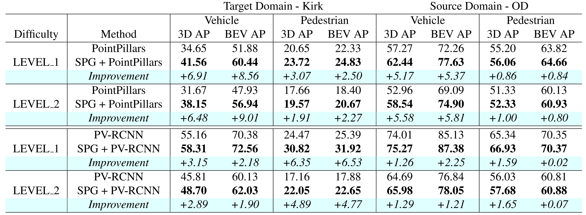

Table 2: Quantitative results - baseline 3D object detectors vs. SPG extended pipeline

 

For the UDA task, on the one hand, the authors compare the performance of the baseline object detectors with a pipeline that combines SPG with the corresponding object detector (see table 2). All of them are trained on the OD training set and evaluated on both the OD validation set and the Kirk validation set. As we can see, the pipelines with SPG preprocessing outperform the baseline for both detectors at both difficulty levels and object classes.

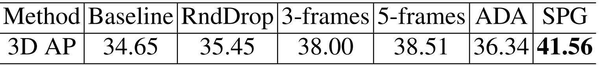

Table 3: Quantitative results - "basic" UDA methods vs. SPG

 

On the other hand, they compare their method to some "basic" UDA methods (see table 3). For example, the second best performing method, 5-frames, simply fuses the last four frames in history with the current keyframe using the ground truth ego-motion and applies an object detector on that modified point cloud.

For the general 3D object detection task, the authors compare car detection results on the KITTI test set produced by their method with those of other 3D object detectors.

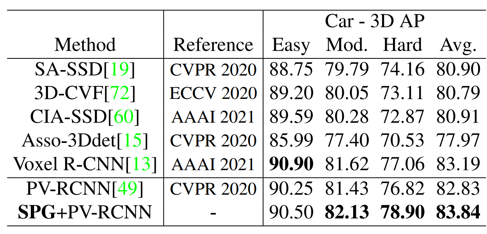

Table 4: Quantitative results for general 3D object detection

 

As we can see in table 4, SPG outperforms recent 3D object detectors on the moderate and hard difficulty level (on the 3rd of March).

 

### **Qualitative results**
The following figures show some qualitative results of SPG:

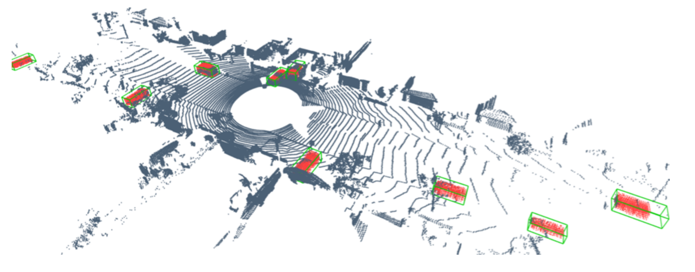

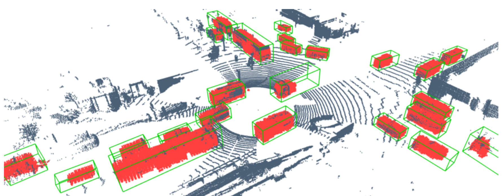

Figure 7: Qualitative results

 

The grey points represent original points, the red points are the generated semantic points, and the green boxes are the 3D bounding boxes predicted by the external 3D object detector.

 

---

 

## **Discussion**

In my opinion, SPG is a relevant model since it is one of the first learning-based approaches that targets UDA for 3D point cloud detection. The method is intuitive because it mainly consists of well-known model parts from the Voxelnet and Pointpillars paper or basic CNNs and FC layers. Besides that, the objective functions are relatively easy to understand.
 Unfortunately, the authors only compare SPG to baseline 3D object detectors or “basic” (i.e., not-learning based or originally 2D) UDA methods but not to any other learning-based 3D UDA method such as ST3D [[8]](#8). Furthermore, they also denote SPG as a general approach. For 3D object detection, the authors show that SPG generally improves detection accuracy. However, regarding UDA, they only prove that their method works well on the Waymo Domain Adaptation dataset, where the main problem is the missing points related to the different weather conditions.

Therefore, in the end, the following questions remain:

- How does SPG perform compared to ST3D in UDA for 3D object detection? 

- Does the model still perform well in the UDA task if the root cause of the domain gap is not related to missing LiDAR points, for example, for different object sizes (see also [[2]](#2))?

 

---

 

## **References**

<a id="1">[1]</a> Xu, Qiangeng, et al. "Spg: Unsupervised domain adaptation for 3d object detection via semantic point generation." Proceedings of the IEEE/CVF International Conference on Computer Vision. 2021.

<a id="2">[2]</a> Wang, Yan, et al. "Train in germany, test in the usa: Making 3d object detectors generalize." Proceedings of the IEEE/CVF Conference on Computer Vision and Pattern Recognition. 2020.

<a id="3">[3]</a> Li, Ruihui, et al. "Pu-gan: a point cloud upsampling adversarial network." Proceedings of the IEEE/CVF international conference on computer vision. 2019.

<a id="4">[4]</a> Zhou, Yin, and Oncel Tuzel. "Voxelnet: End-to-end learning for point cloud based 3d object detection." Proceedings of the IEEE conference on computer vision and pattern recognition. 2018.

<a id="5">[5]</a> Lang, Alex H., et al. "Pointpillars: Fast encoders for object detection from point clouds." Proceedings of the IEEE/CVF conference on computer vision and pattern recognition. 2019.

<a id="6">[6]</a> Sun, Pei, et al. "Scalability in perception for autonomous driving: Waymo open dataset." Proceedings of the IEEE/CVF conference on computer vision and pattern recognition. 2020.

<a id="7">[7]</a> Andreas Geiger, et al. "Are we ready for Autonomous Driving? The KITTI Vision Benchmark Suite." Conference on Computer Vision and Pattern Recognition (CVPR). 2012.

<a id="8">[8]</a> "St3d: Self-training for unsupervised domain adaptation on 3d object detection." Proceedings of the IEEE/CVF Conference on Computer Vision and Pattern Recognition. 2021.